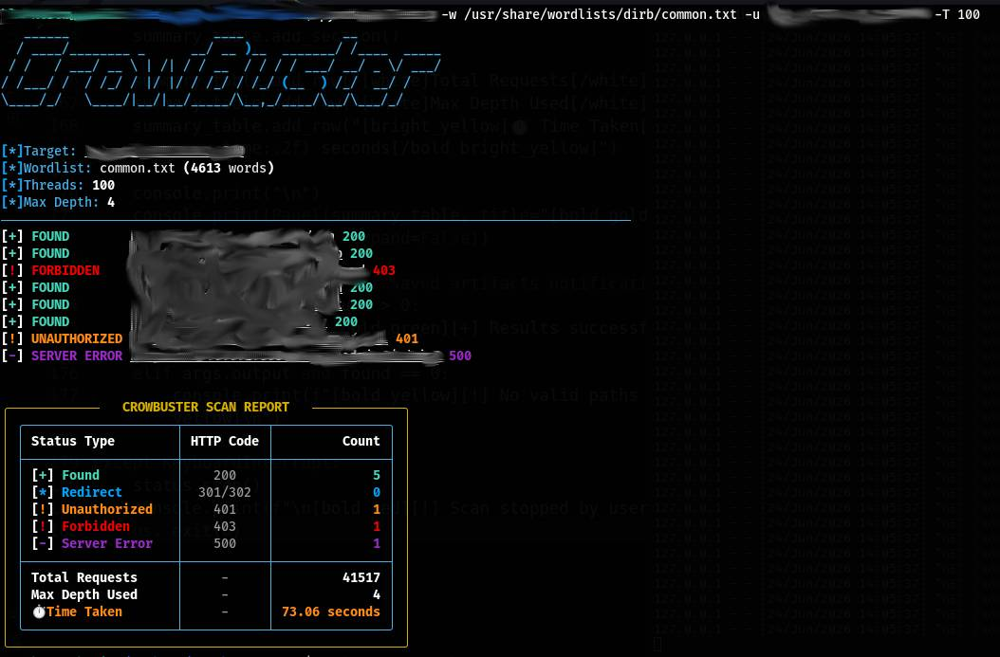
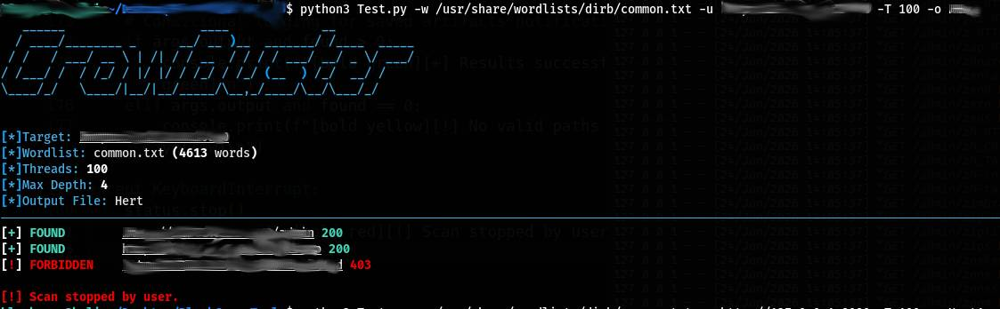
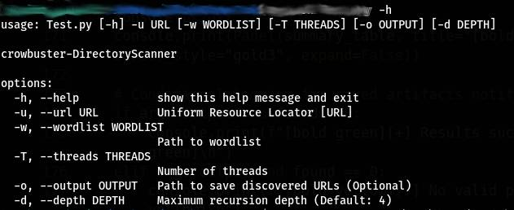

# CrowBuster 🦅

[](https://www.kali.org)
[](https://python.org)
[](https://opensource.org/licenses/MIT)

An advanced, high-performance, and recursive multi-threaded web directory and file fuzzer tailored for penetration testers and security researchers. Fully developed and optimized inside **Kali Linux**, this tool leverages connection pooling and thread-safe concurrency to uncover hidden paths with blazing-fast speeds.

---

## 🚀 Key Features

* **Recursive Fuzzing:** Automatically drills down into newly discovered directories up to a customizable max depth.
* **Blazing Fast Concurrency:** Utilizes Python's `ThreadPoolExecutor` alongside persistent `requests.Session()` (HTTP Keep-Alive) to eliminate connection overhead.
* **Thread-Safe Architecture:** Built-in mutex locking mechanism (`threading.Lock`) prevents data corruption during terminal output, counter increments, and file logging.
* **Robust UI/UX:** Powered by the `rich` library, featuring a live dynamic tracking status and a comprehensive post-scan summary dashboard.
* **Graceful Exception Handling:** Fully optimized to intercept user interruptions (`Ctrl+C`) cleanly without terminal crashes or stack traces.

---

## 📸 Screenshots & Showcase

### 1. Full Successful Scan Breakdown
*Below is the complete dashboard summary showing the structured table report and time elapsed after a thorough target fuzzing.*


### 2. Graceful Interruption (KeyboardInterrupt)
*Demonstrating the robust error handling where the tool securely stops and exits on user demand without breaking the terminal.*


### 3. Help Menu & Argument Parser
*The neat, organized CLI guide showcasing all available custom arguments and parameters.*


---

## 🛠️ Installation & Setup

Since it's built and fully compatible with **Kali Linux**, clone the repository and install the dependencies directly:

```bash
# Clone the repository
git clone https://github.com/BlackCrow-Code/crowbuster.git
   
# Navigate into the project directory
cd crowbuster
             
# Install required packages
pip install -r requirements.txt
```
📖 Usage Guide & Examples
Help Options

To view all available parameters and configurations:
```bash

python3 crowbuster.py -h
```
Basic Directory Fuzzing

```bash
python3 crowbuster.py -u https://example.com -w wordlist.txt
```
Advanced High-Thread Scanning with Output Logging

Fuzz a target utilizing 40 concurrent threads, setting a strict recursion limit of 2 levels deep, and dumping all discovered routes (200 OK) into a file:
Bash

```bash
python3 crowbuster.py -u [https://example.com](https://example.com) -w wordlist.txt -T 40 -d 2 -o live_paths.txt
```

## ⚙️ Available Arguments

Argument	Long Flag	Description	Default

-u	--url	[Required] The target Uniform Resource Locator	None

-w	--wordlist	[Required] Path to your custom payload list	None

-T	--threads	Number of concurrent worker threads	15

-d	--depth	Maximum allowed directory recursion depth	4

-o	--output	Save valid discovered paths to a local file	None


## ⚠️ Additional Terms, Disclaimer & Advice

[!WARNING]
1. Legal & Ethical Use Only

Notwithstanding the permissions granted in the MIT License, the use of this software ("crowbuster") for any illegal activities, unauthorized cyber operations, malicious hacking, or any action that causes harm to individuals or organizations is strictly prohibited. This software is intended solely for educational, research, and authorized ethical security testing purposes.

[!IMPORTANT]
2. Developer Disclaimer 

The developer (BlackCrow-Code) is absolutely NOT responsible for any misuse, unethical deployment, or illegal damage caused by this tool. By utilizing this software, you agree to take full legal and ethical liability for your actions and your scanning targets.

[!TIP]
3. Professional Security Advice 

Always ensure you have written, explicit authorization (such as an active Bug Bounty scope or an official Pentest agreement) before initiating any automated scan against a target. Unauthorized fuzzing can be flagged as a cyber attack, impact service availability, or result in permanent IP bans. Stay ethical, keep learning, and use your skills strictly to build and secure.


## 📜 Credit & License
 Author:-

Developer: BlackCrow-Code

Source Profile: [https://github.com/BlackCrow-Code](https://github.com/BlackCrow-Code)

License: [https://github.com/BlackCrow-Code/LICENSE](https://github.com/BlackCrow-Code/crowbuster?tab=License-1-ov-file)
### License
This project is licensed under the **MIT License** with **Additional Custom Developer Terms**. 

Please review the full license text below, alongside the [Additional Terms & Disclaimer](#-additional-terms-disclaimer--advice) section above, which constitutes an essential condition for utilizing this software.
